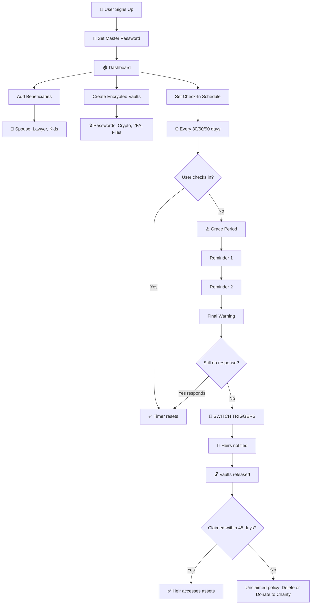
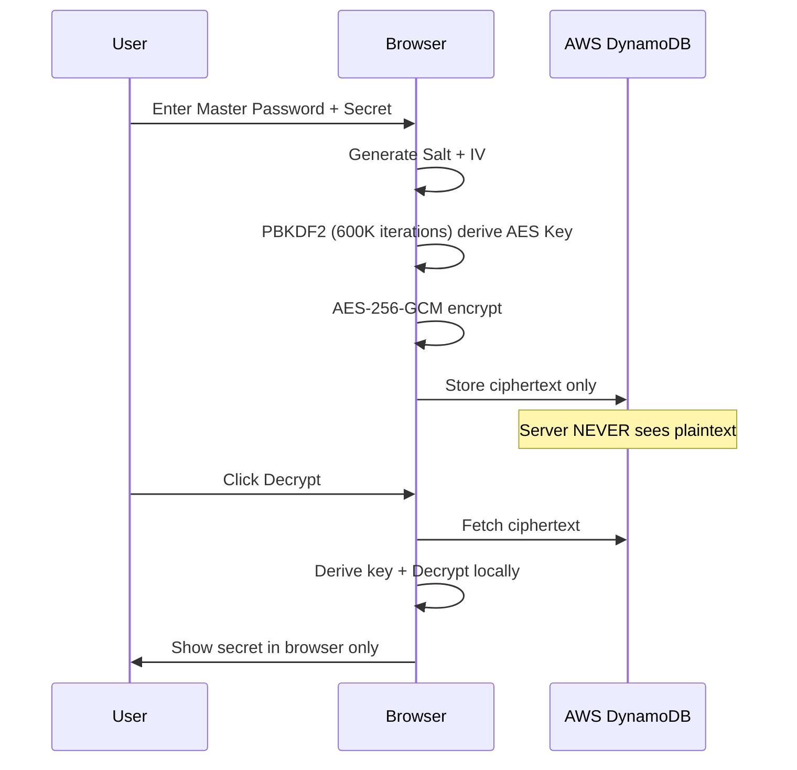
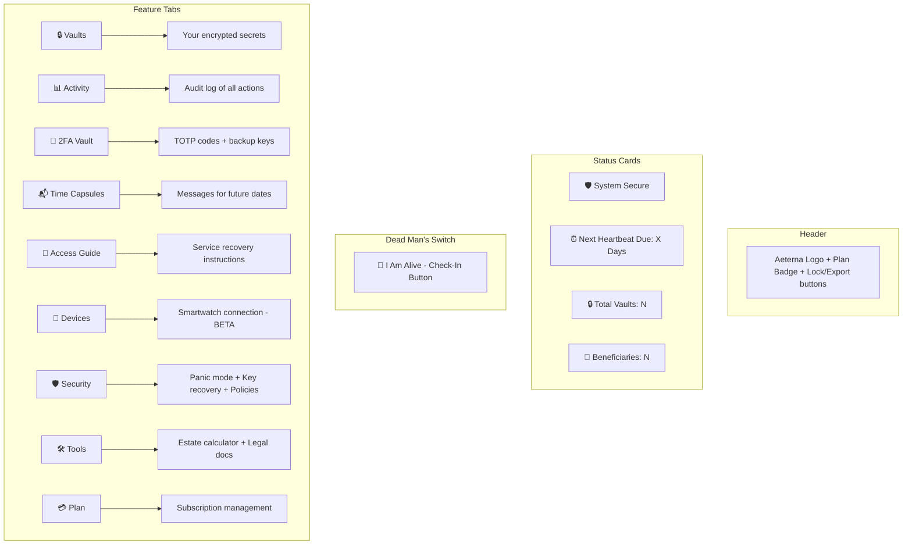
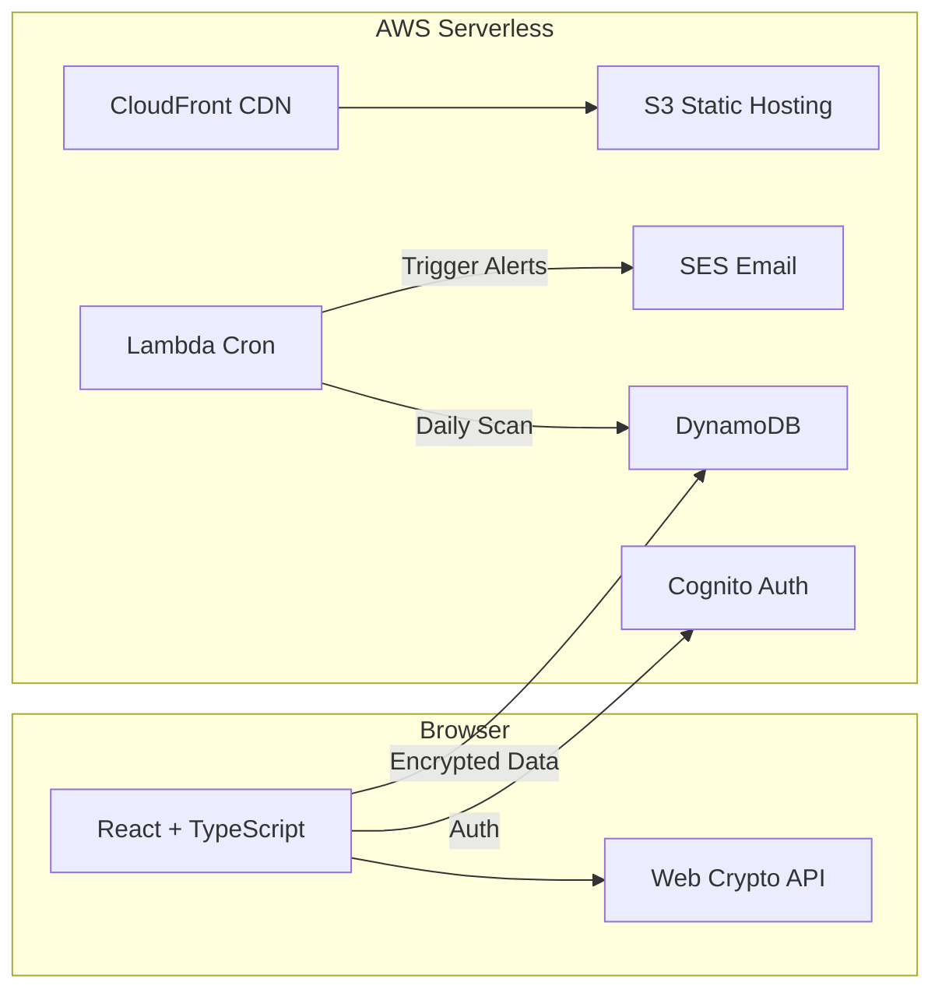

# Aeterna — Digital Estate Planner 🔐

> *"Your digital life shouldn't die with you."*

## 💀 The Problem

When someone passes away or becomes incapacitated, their **entire digital life** becomes either **lost forever** or a **massive legal nightmare** for their family:

- 💰 **Crypto wallets** locked behind seed phrases no one knows
- 📸 **Cloud photos & memories** trapped in accounts with no recovery path
- 🏦 **Bank logins** inaccessible to grieving spouses
- 📱 **2FA locks** — even with the password, Two-Factor Authentication blocks access
- 💳 **Subscriptions still charging** a deceased person's card for months
- 💬 **Private messages** families desperately need but can never reach

## ✅ The Solution — Aeterna

A highly secure **Dead Man's Switch** and **Digital Estate Planner**.

1. **🔒 Vault** — Store encrypted passwords, crypto keys, 2FA codes, messages, files
2. **💓 Check-In** — Tap "I'm alive" every 30/60/90 days
3. **⚠️ Verify** — Missed check-in? Grace period + 3 reminders before trigger
4. **🚀 Release** — All check-ins failed? Vaults released to designated heirs

---

## 🔄 Complete System Flow



## 🔐 How Encryption Works



## 📱 Dashboard Guide (After Login)

When you log in and enter your master password, here's what you see:



### Tab Descriptions:

| Tab | What It Does |
|-----|-------------|
| **Vaults** | Create, view, decrypt, and delete encrypted vault entries |
| **Activity** | See every action you've taken (check-ins, decrypts, deletes) |
| **2FA Vault** | Store your TOTP secrets and backup codes per service |
| **Time Capsules** | Schedule encrypted messages for milestones (wedding, birthday) |
| **Access Guide** | Step-by-step questionnaire → generates recovery guides for your heirs |
| **Devices** | Connect smartwatch for passive check-in (BETA — native app coming soon) |
| **Security** | Panic mode (duress pin), Shamir key recovery, unclaimed estate policy |
| **Tools** | Estate value calculator, legal authorization letter generator |
| **Plan** | View/upgrade subscription (Free / Pro ₹499 / Family ₹999) |

## ✅ Features (Working NOW)

- 🔒 End-to-End Encrypted (ALL fields)
- 💓 Manual Heartbeat Check-In
- 📅 Scheduled Date Trigger (milestone delivery)
- ⚠️ Emergency Escalation (grace period + reminders)
- 👥 Multi-Beneficiary Management
- 🔑 2FA Recovery Vault (TOTP + backup codes)
- 📹 Video/Voice Messages (encrypted)
- 📁 File Upload (drag-drop, encrypted)
- 📂 **Document Vault (Life Locker)** — 10 categories, upload/rename/preview/notes
  - 🏦 Financial (bank, FD, PPF, mutual funds, bonds, LIC)
  - 🏠 Property (land registry, sale deeds, building plans)
  - 🪪 Identity (Aadhaar, PAN, passport, voter ID, DL)
  - ⛽ Utilities (gas, electricity, water, telephone, DTH)
  - 🏧 Banking & Lockers (locker details, cards, net banking)
  - 💊 Medical (insurance, prescriptions, reports)
  - ⚖️ Legal (will, POA, agreements, court orders)
  - 🎓 Education (degrees, marksheets, certificates)
  - 💻 Digital (email recovery, social media, subscriptions)
  - 📦 Personal (marriage cert, family photos, adoption)
  - Free tier: 2 documents | Pro/Family: Unlimited
- 📬 Time Capsule Messages
- 🧳 Panic Mode / Duress Pin
- 🔑 Shamir's Secret Sharing (key recovery)
- ⏱️ Auto-Lock (5 min inactivity)
- 💾 Vault Export (.aeterna backup)
- 📖 Digital Access Guide (15+ service recovery guides)
- 💰 Estate Value Calculator
- 📋 Legal Document Generator
- 📝 Activity Log
- 🎯 Onboarding Flow
- 🔔 Toast Notifications
- 👁️ Heir Dashboard Preview
- 🆘 Emergency Wallet Card
- 📧 Trusted Contact Awareness
- 🏛️ Unclaimed Estate Policy (delete/donate)
- 🎁 Charity Donation Partners
- 💳 Pricing Tiers (Free/Pro/Family)

## 🚧 Beta / Coming Soon

| Feature | Status | What's Needed |
|---------|--------|---------------|
| ⌚ Smartwatch Passive Check-In | BETA | Native mobile app for Bluetooth |
| 🔗 Social Proof of Life | BETA | OAuth integration with platforms |
| 📧 Real Email Delivery | Pending | SES domain verification |
| 💳 Real Stripe Payments | Pending | Stripe API keys |
| 🌐 Custom Domain | Pending | Domain registration |

## 🏗️ Architecture



## 🚀 Quick Start

```bash
npm install
npm run dev          # Frontend at localhost:5173
npx ampx sandbox     # Deploy backend (Cognito + DynamoDB + Lambda)
```

## 💰 Pricing

| Plan | Price | Limits |
|------|-------|--------|
| Free | ₹0 | 3 vaults, 1 beneficiary |
| Pro | ₹499/year | Unlimited vaults, 5 beneficiaries, all features |
| Family | ₹999/year | Unlimited everything + priority support |

---

**Built with** ❤️ **by Krishna** | 25+ Working Features | AWS Serverless
