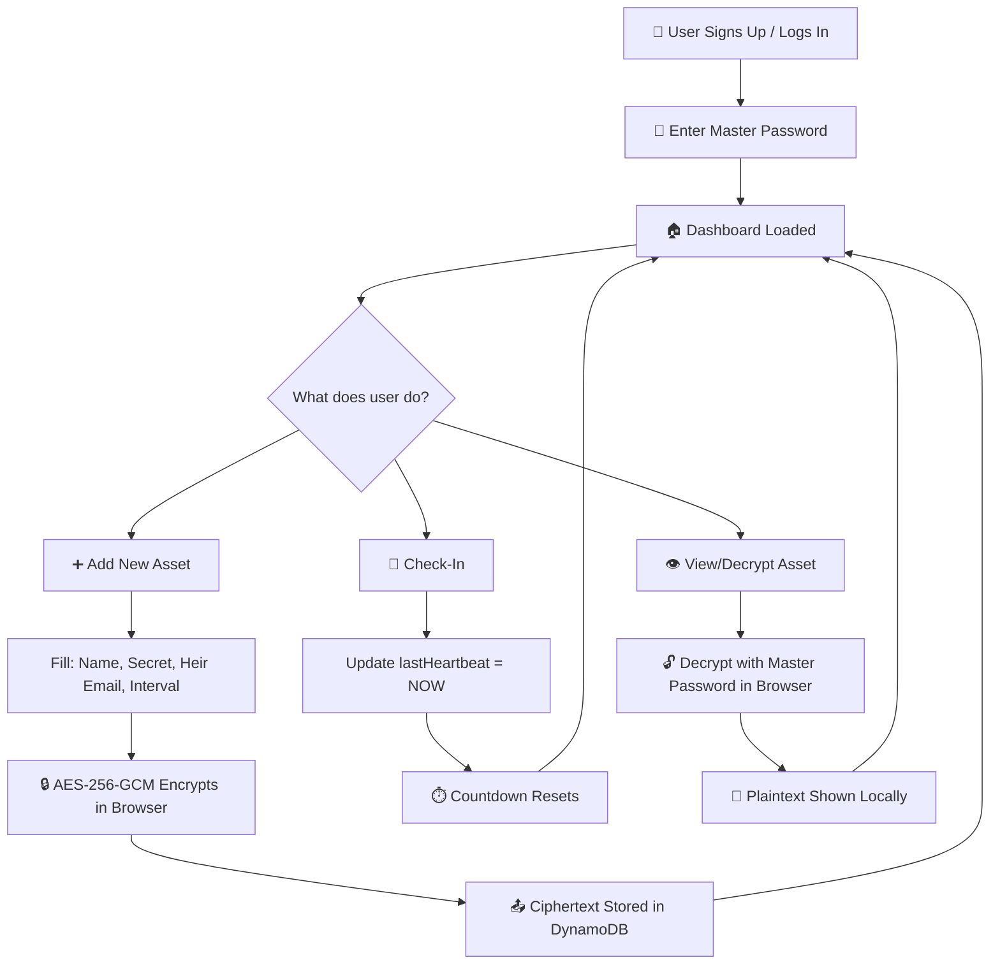
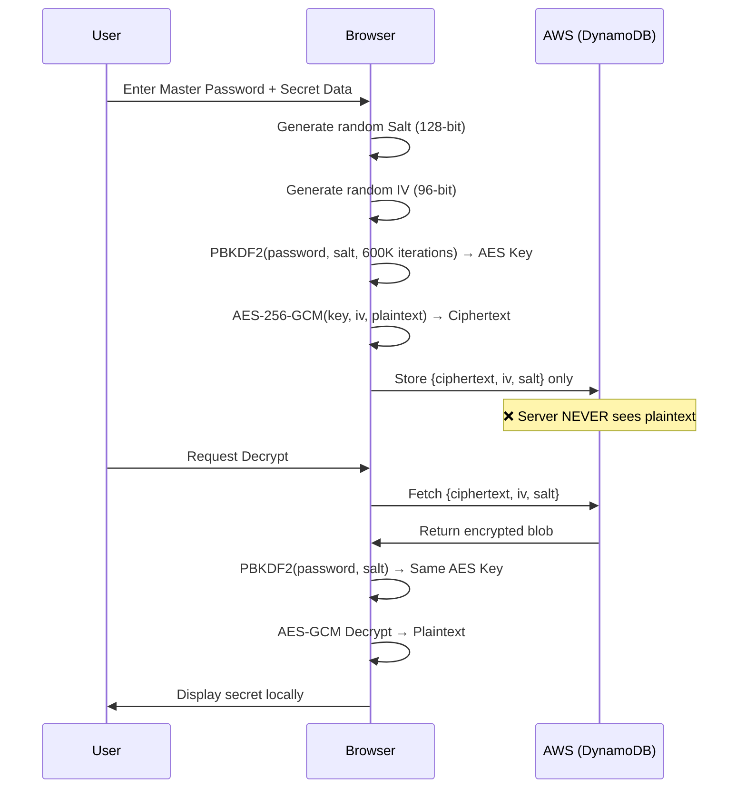
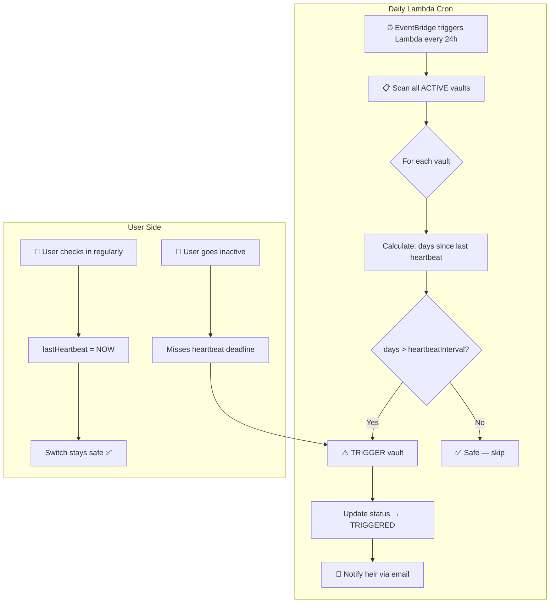
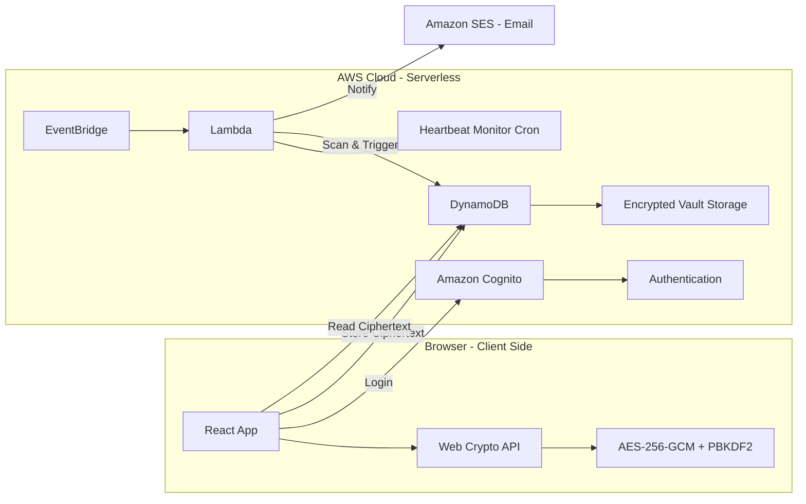

# Aeterna — Digital Estate Planner 🔐

> *"Your digital life shouldn't die with you."*

## 💀 The Problem

When someone passes away or becomes incapacitated, their **entire digital life** becomes either **lost forever** or a **massive legal nightmare** for their family:

- 💰 **Crypto wallets** with millions locked behind seed phrases no one knows
- 📸 **Cloud photos & memories** trapped in accounts with no recovery path
- 🏦 **Bank logins & financial accounts** inaccessible to grieving spouses
- 📱 **2FA locks** — even with the password, Two-Factor Authentication blocks access
- 💳 **Subscriptions still charging** a deceased person's credit card for months
- 💬 **Private messages & documents** that families desperately need but can never reach
- 🌐 **Social media accounts** left in limbo — no way to memorialize or close them

**The hard truth:** Passwords are locked in phones. Recovery emails point to other locked accounts. Families spend months fighting with tech companies, hiring lawyers, and petitioning courts — often to get *nothing* back.

## ✅ The Solution — Aeterna

A highly secure, legally-binding **"Dead Man's Switch"** and **Digital Estate Planner**.

### How It Works (Simple Version):

1. **🔒 Vault Your Digital Life** — Users securely store their digital access instructions, personal video messages, crypto keys, passwords, and asset locations in encrypted vaults.

2. **💓 Check-In Regularly** — The app requires the user to "check in" every 30/60/90 days (configurable per vault). Just tap a button — *"I'm alive."*

3. **⚠️ Emergency Verification** — If a check-in is missed, Aeterna doesn't immediately release anything. It first triggers emergency contact verification (SMS, email, backup contacts) to prevent false alarms.

4. **🚀 Smart Release Protocol** — If the user fails multiple check-ins AND doesn't respond to emergency verifications, Aeterna triggers an automated release protocol that delivers specific encrypted vaults to designated **Executors**:

| Executor | What They Receive |
|----------|------------------|
| 👫 Spouse | Family photo cloud password, joint account access, home security codes |
| 👨‍⚖️ Lawyer | Crypto seed phrases, business account credentials, financial documents |
| 👶 Children | Scheduled personal video messages, education fund details, memory archives |
| 🤝 Business Partner | Company credentials, API keys, server access, intellectual property docs |

### Why Aeterna is Different:

- **🛡️ End-to-End Encrypted** — The server NEVER sees your plaintext data. Even if our database is hacked, attackers get nothing but scrambled garbage.
- **⏱️ Configurable Timers** — Set different heartbeat intervals per vault (30 days for critical assets, 90 days for personal messages).
- **🚫 No Single Point of Failure** — Multiple verification steps before any release happens.
- **📹 Personal Messages** — Record video/text messages that are delivered to loved ones only after you're gone.
- **⚖️ Legally Structured** — Designed to work alongside existing wills and estate planning.
- **🌍 Works Globally** — No jurisdiction dependency. Your data, your rules.

---

## 🏗️ Technical Architecture

| Layer | Technology |
|-------|-----------|
| Frontend | React + Vite + TypeScript + Tailwind CSS |
| Icons | Lucide React |
| Backend | AWS Amplify Gen 2 (Serverless) |
| Database | Amazon DynamoDB (via Amplify Data) |
| Authentication | Amazon Cognito (via Amplify Auth) |
| Automation | AWS Lambda (scheduled daily cron) |
| Security | Web Crypto API (AES-256-GCM + PBKDF2) |

## 🔄 How It Works — Workflow Diagrams

### End-to-End User Flow



### Encryption Flow (Client-Side Only)



### Dead Man's Switch — Automation Flow



### System Architecture Overview



## 🎨 Design System

- **Theme:** Strict Dark Mode ("Premium Swiss Bank" aesthetic)
- **Background:** Deep Navy (#0B1120)
- **Cards:** Lighter Slate (#1E293B)
- **Accents:** Subtle Gold (#D4AF37)
- **Text:** Off-white (slate-200) and muted gray (slate-400)

## 📂 Project Structure

```
aeterna/
├── amplify/
│   ├── auth/
│   │   └── resource.ts              # Cognito authentication config
│   ├── data/
│   │   └── resource.ts              # DynamoDB schema (Vault model)
│   ├── functions/
│   │   └── heartbeat-monitor/
│   │       ├── resource.ts          # Lambda schedule definition
│   │       └── handler.ts           # Dead Man's Switch logic
│   └── backend.ts                   # Main Amplify backend definition
├── src/
│   ├── components/
│   │   ├── AuthGate.tsx             # Auth + Master Password gate
│   │   ├── Dashboard.tsx            # Main dashboard UI
│   │   └── AddAssetModal.tsx        # Encrypted vault creation form
│   ├── utils/
│   │   └── crypto.ts               # Client-side AES-GCM encryption
│   ├── App.tsx                      # Root component with Amplify config
│   └── index.css                    # Tailwind + theme styles
├── tailwind.config.js
├── postcss.config.js
├── vite.config.ts
├── tsconfig.json
└── package.json
```

## 🚀 Prerequisites

1. **Node.js 18+** — [Download](https://nodejs.org/)
2. **AWS Account** — [Sign up for Free Tier](https://aws.amazon.com/free/)
3. **AWS CLI configured** — Run `aws configure` with your credentials
4. **Amplify CLI** — Installed as a project dev dependency

## 📦 Setup & Installation

```bash
# 1. Navigate to the project directory
cd Aeterna

# 2. Install dependencies (already done if you cloned this repo)
npm install

# 3. Deploy the Amplify sandbox (creates AWS resources)
npx ampx sandbox

# This will:
# - Create a Cognito User Pool for authentication
# - Create a DynamoDB table for the Vault model
# - Deploy the heartbeat-monitor Lambda function (daily cron)
# - Generate amplify_outputs.json for frontend configuration
```

## 🏃 Running Locally

```bash
# Start the Amplify sandbox (backend - keep running in terminal 1)
npx ampx sandbox

# In a new terminal, start the Vite dev server (frontend)
npm run dev
```

The app will be available at `http://localhost:5173`

## 🌐 Production Deployment

```bash
# Deploy to production (creates a separate production stack)
npx ampx pipeline-deploy --branch main --app-id YOUR_APP_ID

# Or use Amplify Hosting:
# 1. Push to GitHub
# 2. Connect repo in AWS Amplify Console
# 3. Amplify auto-builds and deploys on every push
```

## 💰 SaaS Considerations (Future Enhancements)

- **Stripe Integration** — Subscription tiers (Free: 3 vaults, Pro: unlimited)
- **Amazon SES** — Real email notifications when Dead Man's Switch triggers
- **Multi-tenant isolation** — Already built-in via Cognito owner-based auth
- **Usage metrics** — CloudWatch dashboards for monitoring
- **Custom domains** — Via Amplify Hosting
- **SOC 2 Compliance** — End-to-end encryption architecture simplifies compliance

## 🔐 Security Notes

- Master password never leaves the browser or gets stored anywhere
- PBKDF2 with 600,000 iterations (exceeds OWASP 2024 minimum)
- AES-256-GCM provides authenticated encryption (tamper detection)
- Each vault entry uses a unique random salt and IV
- DynamoDB items are owner-scoped (users can only access their own data)
- No plaintext data exists on the server — ever

## 📋 Environment Variables (Lambda)

The heartbeat monitor Lambda requires:
- `VAULT_TABLE_NAME` — Auto-injected by Amplify from the data resource

## 🧪 Testing

```bash
# Run type checking
npx tsc --noEmit

# Run Vite build
npm run build
```

## 📄 License

Private — All rights reserved.

---

**Built with** ❤️ **by Krishna** | End-to-End Encrypted | AWS Amplify Gen 2
